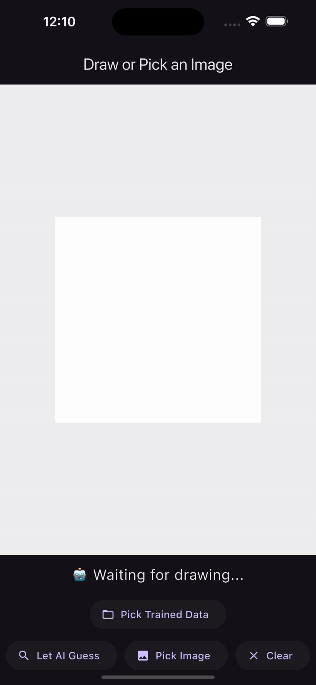

# 👼🏾 PARI

**Pari** is an AI-powered sketch recognition app inspired by [Google's Quick Draw Game](https://github.com/googlecreativelab/quickdraw-dataset). It uses a CNN model trained on 15 categories from over 50 million open-source vector drawings across 345+ categories.



✨ Built with:

- TensorFlow + Keras
- OpenCV
- Python
- Flutter (for mobile integration)
- TFLite (for on-device inference)

---

## ✅ Features

- 🎨 Download QuickDraw dataset (.ndjson format)
- 🖼️ Convert vector strokes to 28x28 grayscale images
- 🧠 Train a CNN for sketch recognition
- 📱 Convert the model to TensorFlow Lite (TFLite)
- 🚀 Use it in a Flutter app to guess what you draw!

---

## 🛠️ Setup

### 1️⃣ Create and Activate a Virtual Environment

**Using `venv` (recommended):**

```bash
python3.10 -m venv quickdraw_env
source quickdraw_env/bin/activate        # macOS/Linux
# OR
quickdraw_env\Scripts\activate           # Windows
```

**Using `Conda` (alternative):**

```bash
conda create --name quickdraw_env python=3.10
conda activate quickdraw_env
```

### 2️⃣ Install Required Packages

```bash
pip install -r requirements.txt
```

### 3️⃣ Run pari.py

```bash
python3 pari.py
```

It will generate **quickdraw_cnn.tflite**, copy it to flutter path

## 📲 Copy Model to Flutter App

Once the model is converted, copy the `.tflite` file and label file to your Flutter assets directory:

Sure! Here's the **plain Markdown format** for the folder structure, ready to copy and paste:

```markdown
📁 your_flutter_project/
├── lib/
├── assets/
│ └── model/
│ ├── quickdraw_cnn.tflite
│ └── categories.txt
```

Make sure to declare the assets in your `pubspec.yaml`:

```yaml
flutter:
  assets:
    - assets/model/quickdraw_cnn.tflite
    - assets/model/categories.txt
```

# 🧠 Flutter Implemntation

This is the flutter implentation of the app, where you will see the model being used.

## 🛠️ Setup

You need to set the dependencies, you can do it by

```bash
flutter pub get
```

### 🛠️ iOS Permissions for Saving and Accessing Photos

Add the following lines inside your `ios/Runner/Info.plist` file **within the `<dict>` tag**:

```xml
<key>NSPhotoLibraryUsageDescription</key>
<string>We need access to your photo library to save your drawings.</string>

<key>NSCameraUsageDescription</key>
<string>We need access to your camera to let you pick photos.</string>

<key>NSPhotoLibraryAddUsageDescription</key>
<string>We need permission to save the drawing to your photo gallery.</string>
```

✅ These keys are required by iOS to use the image picker and save to the photo gallery without crashing the app.

### Run the app

```bash
flutter run
```
